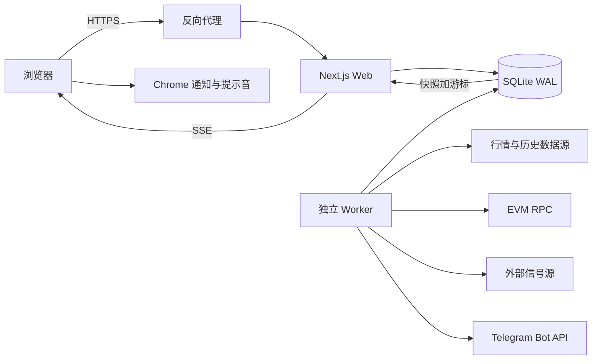

# Show Tools 技术说明（公开脱敏版）

> 文档状态：2026-09-09，对应应用版本 v4.13。
>
> 这是一份可以放入公开代码库的脱敏文档。它不包含真实域名、服务器 IP、SSH 主机名、
> SSH 用户、私钥、API Key、访问令牌、Cookie、邀请码、管理员账号、生产用户数据或数据库内容。
> 文中的 `<...>` 都是占位符，不能直接用于生产。

## 1. 系统目标与边界

Show Tools 是一个只读监控系统，主要解决四类问题：

1. 共享代币看板：跟踪价格、流动性、成交量、ATH 与回撤。
2. 个人钱包监控：发现钱包持仓，计算持仓价值，并监测暴涨与滚动新高。
3. 外部信号汇总：保存并展示群聊信号，同时补充行情和项目方公开链接。
4. 通知可靠性：把报警持久化后通过 SSE 送到浏览器，并监测声音、连接、后端和读取链路。

系统明确不做私钥托管、钱包签名、交易模拟、自动交易或下单。

## 2. 总体架构



生产形态是一个 Web 进程和一个 Worker 进程共享同一个 SQLite 文件：

- Web：Next.js 15、React 19，负责页面、账号、权限、API 与 SSE。
- Worker：负责行情轮询、钱包扫描、历史回填、报警状态机、日程和外部信号。
- 数据库：`better-sqlite3` + Drizzle，启用 WAL、外键和 5 秒 busy timeout。
- 反向代理：负责 HTTPS，应用只监听回环地址，不直接暴露应用端口。

## 3. 核心数据流

### 3.1 共享回撤看板

Worker 按配置周期获取池子行情，先进行主池选择和离群值检查，再写入 5 分钟 K 线。
ATH 使用第 k 高等稳健规则，回撤报警由独立状态机处理确认、迟滞、冷却和重新武装。
历史 OHLCV 回填与实时轮询分离，慢速或限流的数据源不能阻塞实时行情。

### 3.2 钱包发现与持仓

每个钱包都绑定到当前登录用户，客户端不能传入或覆盖 `user_id`。EVM 钱包通过 RPC 日志
和余额读取发现代币；首次余额失败会进入持久候选队列，成功之前不会推进为已完成。

钱包扫描基准周期为 12 分钟，新钱包由每分钟的调度检查尽快捞起。钱包地址可以添加备注，
同一用户的多个钱包持有同一个币时只生成一条行情事件，并把相关备注合并进通知。

### 3.3 暴涨报警

钱包行情拆成两条并行流水线。已进入监控的去重代币由 XXYY 每 15 秒批量取价并立即执行
暴涨与 ATH 判定；DexScreener 慢轮次目标周期为 60 秒，每轮有 4,500 个唯一代币的有界预算，
只负责监控资格与元数据。慢轮次的任务优先级如下：

1. 已进入监控的热币：每轮判定。
2. 从未成功判定的新币：优先进入首次判定。
3. 流动性不低于 1,000 美元但尚未进入监控的温币：约每 3 分钟复查。
4. 低流动性或无报价的冷币：约每 30 分钟复查。

技术失败不会被记成成功；重试从约 15 秒指数退避，最长 5 分钟，并带稳定抖动。
各链并行，单条慢链不会堵住其它链；元数据与历史回填进入独立的有界队列。XXYY 快轮次
不等待 DexScreener，也不等待冷币发现和历史回填。

进入监控的默认条件是：

- 流动性不少于 5,000 美元；
- 24 小时成交量不少于 10,000 美元，或 1 小时成交量不少于 2,000 美元；
- 持有人数不超过 100,000；
- 已进入监控后使用 60% 的退出线，并要求连续 30 分钟低于退出线。

暴涨窗口为 5m、1h、6h、24h，价格基准同时考虑窗口开盘价与稳健低点。低点在样本足够时
取第 2 或第 3 低，隔离单个异常针。窗口历史不足时明确标记为数据不足，不拿几分钟数据
冒充 24 小时窗口。

报警档位为 2x、3x、5x、10x，30 分钟内按币去重；没有升档但价格较上次报警再上涨 50%
时可产生进展提醒。状态变更和所有收件人的报警行在同一个 SQLite 事务中写入，任一写入失败
则整体回滚，下一轮可以完整重试。

### 3.4 滚动 ATH 报警

ATH 窗口为 3 天、7 天、30 天、90 天、180 天、360 天和全部历史。只有真实历史覆盖足够时
才启用对应窗口，一次上涨取被突破的最长窗口。

默认需要超过旧高点 10% 才算突破；报警后必须从参照高点回落到 80% 以下才重新武装。
上涨途中若较上次 ATH 报警价再上涨 50%，可以发送进展提醒。ATH 与暴涨使用两套独立判定，
同一轮同时成立时合并为一条事件表达，避免彼此吞掉或重复刷屏。

### 3.5 每用户小额资产阈值

`users.min_alert_value_usd` 是每用户配置：该用户在某币上的所有钱包余额先合计，再按当前价格
计算总资产价值。低于阈值时不发送该用户的暴涨/ATH 提醒，并在持仓页默认折叠；它不改变共享的
`holdings.monitored` 状态，因此不会因为一个用户的小额持仓影响其他用户。

价格、余额和价值的乘除全部使用 `decimal.js`。阈值列本身只用于比较，不参与价格算术。

### 3.6 外部信号与项目链接

外部信号由独立循环拉取，失败不会阻塞行情与钱包监控。信号写入本地表后，页面再叠加当前市值、
回撤和来源信息。代币的官网、X、Telegram、DexScreener 与 XXYY 链接以图标展示；只有上游明确
返回的项目方链接才会保存，缺失时不伪造。

## 4. 行情来源与可信度策略

| 来源 | 用途 | 关键边界 |
|---|---|---|
| DexScreener | 回撤看板价格、钱包资格、池子、流动性、成交量、项目链接 | 批量报价每请求最多 30 个地址；不再决定钱包暴涨/ATH 的当前价 |
| XXYY | 钱包暴涨与 ATH 的唯一实时价格 | 每批最多 500 个地址；15 秒快轮次，必须有独立健康监测 |
| GMGN | 历史数据或代币信息的可选来源 | 需要部署时配置凭据；异常时不能污染实时状态 |
| GeckoTerminal | 历史 OHLCV 兜底 | 免费额度慢，必须独立排队并支持断点续传 |
| CoinGecko | 原生币美元价格与历史 | 限流与粒度会变化，实时和回填共享节流 |
| EVM RPC | `eth_getLogs`、余额、代币元数据 | RPC URL 按密钥处理，超时和错误日志必须脱敏 |
| Solana RPC | `getTokenAccountsByOwner` 钱包快照 | 同时读取 SPL Token 与 Token-2022；两者全部成功后才允许删除旧持仓 |
| 外部信号 API | 群聊信号增量同步 | Bearer 凭据只在服务器 `.env`；失败与空结果分开记录 |

正式钱包报警规则：XXYY 的有效正价格直接决定暴涨当前价、ATH 当前价、持仓价值和报警市值，
DexScreener 的价格不参与放行。XXYY 对某币缺价时，该币本轮暂停，不拿 DexScreener 冒充；
网络、坏响应、整链零覆盖或覆盖率相对健康水位掉到一半以下会累计故障并通知管理员。
DexScreener 与 XXYY 的差异仍可写入 `quote_shadow` 供诊断，但不再阻塞 XXYY 报警。

XXYY 使用独立的 5 分钟 K 线、日高、暴涨状态和 ATH 状态，不与回撤看板的 `candles`、旧
DexScreener/GMGN 历史混算。普通 2x、3x、5x、10x 立即判定；超过 1000x 的单次极端跳变
等待下一次 XXYY 报价在相近量级复核，避免坏点污染且不会永久锁死真实行情。

所有价格必须是有限正数。异常、非正数、跨池口径错误或相对最近可信采样出现极端跳变的报价会
被隔离，不写 K 线、不推进状态机，也不产生提醒。

## 5. 通知与静默失效防护

钱包行情事件先写入 `pump_alerts`，浏览器先取得带数据库序号的历史快照，再从同一序号建立 SSE。
断线重连同时支持 `Last-Event-ID` 和显式游标，服务端只有在整批成功序列化并写入 SSE 后才推进游标。

浏览器通知采用“一事件一条通知”：标题包含币名、所在链和事件类型；正文包含窗口、倍数、
市值变化、持仓价值和钱包备注。声音按同一 SSE 批次只播放一次，避免多条通知叠音。

页面持续检查四类故障：

- 提示音从可用变为失效；
- SSE 实时连接中断；
- SSE 仍连接但后端业务心跳过期；
- 报警记录读取失败。

故障持续 15 秒后弹窗和页面示警，持续故障每 30 分钟再次提醒。报价源连续多轮不健康时也会写入
独立的系统报警；系统报警和行情报警使用不同文案与样式。

## 6. 账号、权限与审计

- 注册：邀请码只在注册时核销，使用次数通过单条条件 `UPDATE` 原子扣减；数据库只存邀请码哈希。
- 密码：使用 Node.js `scrypt`，盐和参数随哈希保存，验证使用定时安全比较。
- 会话：随机 32 字节令牌只放在 httpOnly、SameSite=Lax Cookie；数据库仅存 SHA-256 哈希，默认 30 天。
- 中间件：Edge Runtime 只能检查 Cookie 是否存在；每个 API 路由都必须再次查询数据库验证会话。
- 管理员：由环境变量中的完整账号名列表指定；未配置时无人拥有管理员权限，属于 fail closed。
- 权限：用户只能管理自己的钱包和归属内容；影响全局的停用、冻结、报警档位等操作由管理员控制。
- 审计：敏感修改与审计记录处于同一事务；审计保存操作者和目标快照，后续改名或删除不破坏历史。

## 7. 数据库分区

| 领域 | 主要表 |
|---|---|
| 共享行情 | `tokens`, `pools`, `candles`, `native_prices`, `poll_runs` |
| 回撤 | `ath_state`, `alert_rules`, `alert_states`, `alerts`, `backfill_jobs` |
| 账号权限 | `users`, `sessions`, `invite_codes`, `audit_log` |
| 钱包 | `wallets`, `holdings`, `wallet_token_candidates`, `token_meta` |
| 暴涨与 ATH | `pump_states`, `pump_alerts`, `wallet_ath`, `ath_daily` |
| 健康与影子 | `source_health`, `pump_health`, `quote_shadow` |
| 其它 | `events`, `trash_signals` |

价格、余额和倍数使用 `TEXT` 十进制字符串，避免 SQLite 或 JavaScript 浮点数改变阈值结果。
时间统一存 Unix 秒；界面按指定时区格式化。

## 8. API 分组

所有非登录/注册接口都需要有效账号会话；用户身份只从服务端会话取得。

| 分组 | 代表路径 | 用途 |
|---|---|---|
| 账号 | `/api/account/login`, `/register`, `/logout` | 登录、邀请码注册、退出 |
| 看板 | `/api/tokens`, `/api/tokens/[id]`, `/api/alerts` | 代币、K 线、回撤报警 |
| 设置与日程 | `/api/rules`, `/api/events` | 全局规则和日历提醒 |
| 钱包 | `/api/wallet/wallets`, `/holdings`, `/settings` | 钱包、持仓、个人阈值 |
| 实时报警 | `/api/wallet/alerts`, `/stream` | 历史快照、SSE 与心跳 |
| 外部信号 | `/api/trash` | 已同步信号的本地只读视图 |
| 健康 | `/api/health` | 数据源、回填和轮询状态 |

## 9. 配置与秘密管理

仓库只提交空值或安全默认值的 `.env.example`。生产值只保存在服务器 `.env`，文件权限应限制为
服务账号可读。配置名可以公开，配置值不能进入 Git、日志、截图、技术文档或前端响应。

```dotenv
TELEGRAM_BOT_TOKEN=<secret>
TELEGRAM_CHAT_ID=<secret>
ADMIN_ACCOUNT=<admin-a>,<admin-b>
DATABASE_PATH=<absolute-or-relative-db-path>
COINGECKO_API_KEY=<secret-or-empty>
GMGN_API_KEY=<secret-or-empty>
EVM_RPC_BASE=https://<private-rpc-host>/<private-path>
SOLANA_RPC_URL=https://<authorized-solana-rpc-host>/<private-path>
TRASH_API_BASE=https://<private-api-host>/<path>
TRASH_API_TOKEN=<secret>
```

日志层会注册并掩码所有已知秘密，显示规则为前 4 位和后 4 位，中间替换为星号。RPC endpoint 即使
看似 URL 也按秘密处理，因为路径或查询参数可能携带凭据。

禁止提交：`.env*` 实值文件、SQLite 数据库及 WAL/SHM、备份、私钥、SSH 配置、浏览器 Cookie、
邀请码、访问令牌、生产日志和用户导出数据。

## 10. 部署、备份与恢复

推荐单机 Linux + systemd：

1. 反向代理只开放 80/443，应用监听 `127.0.0.1:<port>`。
2. Web 与 Worker 使用独立 systemd service，共享受限服务账号。
3. 发布前停止写入或使用一致性备份，保存 SQLite 主文件及必要的 WAL 状态。
4. 同步代码时排除 `.git`、`.env`、`data`、备份、依赖目录和构建产物。
5. 先执行 `npm run db:migrate`，再 `npm run build`，最后重启服务。
6. 验证 Web readiness、Worker 完成心跳、定时备份结果和真实报警读取链路。

示例只使用占位符：

```bash
ssh <deploy-user>@<server> 'systemctl is-active <web-service> <worker-service>'
ssh <deploy-user>@<server> 'journalctl -u <worker-service> -n 100 --no-pager'
```

不得把 SSH 私钥内容写进仓库或命令；应使用本机 SSH agent、受限部署密钥或 CI secret。

## 11. 测试与发布门槛

```bash
npm test
npm run typecheck
npm run build
```

涉及数据库时必须额外验证迁移幂等性与旧库升级。涉及报警时应覆盖：状态机边界、同批多事件、
多用户隔离、事务回滚、SSE 断点续传、通知文案和故障提醒。生产端到端测试必须限制收件人并明确
标注“测试”，不能用数据库写入或 SSE 成功代替用户实际看到通知的证明。

## 12. 容量与已知边界

- 单机 SQLite WAL 适合当前低写入并发；扩容前先测真实读写锁等待和数据库大小，不按用户数猜。
- 主要成本取决于“去重后的代币数 × 数据源批次/限流”，不是账号数量本身。
- XXYY 的 500 地址批量能力决定钱包实时报警容量；DexScreener 的 30 地址上限仍限制新币资格
  发现速度，因为 XXYY 不提供流动性与成交量字段，但不会再拖住已监控币的报警。
- 浏览器系统通知依赖用户授权、操作系统设置和浏览器进程；页面关闭后没有浏览器侧送达保证。
- SQLite 单机不能提供跨机器自动故障转移。需要水平扩展时，应先拆分采集 Worker 与 Web，再评估
  PostgreSQL、任务队列和服务端推送通道，而不是直接把当前文件库多机挂载。
- 任何上游 HTTP 200 都不等于数据可信；空响应、过期数据、错误池和跨源冲突必须单独判定。
